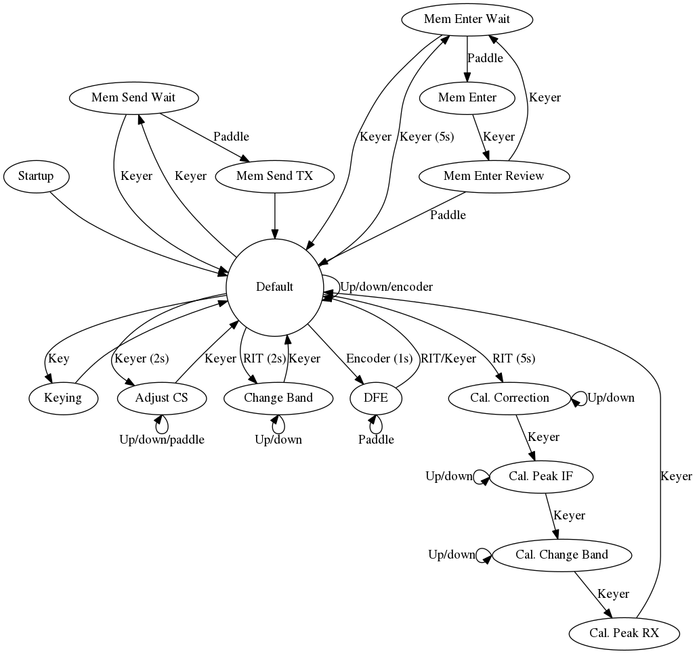
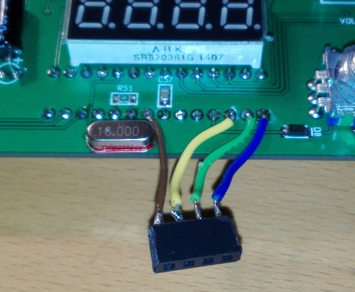
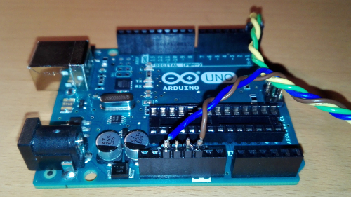

# SODA POP source

This repository contains the source for the [SODA POP][sodapop] by [Steve Weber
KD1JV][kd1jv], a single band QRP CW transceiver on a 3.6" square board.

The original code is copyright &copy; [Steven Weber KD1JV][kd1jv], additions
and changes are copyright &copy; [Camil Staps PD7LOL][cs]. This only goes for
the `SODA_POP` directory. Everything is licensed under GPL v3, see the LICENSE
file.

---

- [Operation](#operation)
- [Settings](#settings)
- [Optional features](#optional-features)
- [How to flash the firmware](#how-to-flash-the-firmware)
- [Changelog](#changelog)

---

## Operation

To a large extent, operation is as described in the manual.
It can be described by the state machine below.
A detailed description is given under the image.

### Startup
On startup, the band will be shown (e.g. `bn.20`). After a 1s delay, the rig
will turn on.

### Tuning
Use the rotary encoder to tune. The default step is 50Hz. By pressing the
rotary encoder, the step can be changed to 200Hz. Pressing again goes back to
50Hz. These steps can be changed in `settings.h`.

### RIT
Pressing the RIT button turns RIT on. The display will show the RIT offset.

### Message memory
Pressing the keyer switch allows you to send a message from memory. There are
two messages, use either side of the paddle to send one. Use the keyer switch
to cancel.

To update the memory, hold the keyer switch for 5s. The display will say
`Entr.`. Enter the message using the paddle. This is not possible with a
straight key. The display will flash once after a character space is detected,
and once again after a word space has been detected. To finish, press the keyer
switch again. The message will be played back while the display reads `Ent.?`.
After this, store the message with either side of the paddle. Pressing the
keyer switch allows you to key in a message again; pressing the keyer switch
once more returns to the default state.

The maximum message length is 64 by default (can be changed in `settings.h`).
If you try to enter more characters, the error routine is enabled (see below).

### Settings
Change the code speed by holding the keyer switch for 2s. The display will read
`CS.20`, where `20` is the speed in WPM. Use the paddle or the rotary encoder
to change, and save with the keyer switch.

Change the band by holding the RIT switch for 2s. The display will read
`bn.20`, where `20` is the band. Save with the keyer switch. This is only
possible when compiled with `OPT_BAND_SELECT` (see 'Optional features' below).

### Calibration
The calibration routine is explained in the manual. Hold the RIT switch for 5s
to enter the calibration routine.

The display will read `corr.`. You can correct the Si5351 by connecting a
frequency counter to TP3 and fixing it to 10MHz using the rotary encoder.

Move on with the keyer switch (the display will read `P. IF`). Adjust CT3 to
peak the signal on TP2. Peak the IF LO frequency using the rotary encoder,
peaking the signal on TP1 *with a scope*. If you changed this, go back to
changing CT3 and repeat.

Move on with the keyer switch (the display will read `bn.16`) and set the band
using the rotary encoder.

Move on with the keyer switch (the display will read `P. rX`) and peak the
signal using CT1 and CT2. The adjustment can be sharp, especially on higher
frequency bands.

Pressing the keyer switch will return to the default state.

### Errors
When an error is detected, the display will read `Err.` and a alarm will be
sounded. The only way to recover is to restart the rig.

## Settings
There are several compile-time settings in `settings.h`. Change them before
uploading the code to the chip.

- `WPM_DEFAULT`: the default key speed in WPM (20).
- `TUNE_STEP_DEFAULT`: the default tune step (50Hz) in mHz.
- `TUNE_STEP_ALT`: the alternative tune step (200Hz), enabled by pressing the
  rotary encoder.
- `KEY_MIN_SPEED`: the minimum key speed in WPM (5). Lower speeds than 5 may
  damage the rig, because the on-time for dashes will be rather long.
- `KEY_MAX_SPEED`: the maximum key speed in WPM (30). Higher speeds than 30 are
  untested and may present timing issues.
- `SIDETONE_FREQ`: the frequency of the sidetone in Hz (600).
- `MEMORY_LENGTH`: the maximum length of messages in memory, including word
  spaces (64). Higher values than 255 are unsupported.
- `MEMORY_EEPROM_START`: the start address of the memory in EEPROM (16). Don't
  change this unless you know what you're doing.

## Optional features
There are several features that can be added to the rig if you want to. This is
done by adding and removing `#define` lines to `settings.h`.

- `OPT_BAND_SELECT`: change the band by pressing RIT for 2s.
- `OPT_ERASE_EEPROM`: erase the EEPROM by holding RIT for 8s.

## How to flash the firmware

By far the easiest way to reprogram the controller is using an
[Arduino Uno][uno].

If you are only planning on flashing new firmware once or twice, just take the
controller from the SODA POP, plug it in the Arduino, flash it, and put it
back.

If you are planning on working on the firmware yourself, you will need to flash
much more often. Not only is moving the chip back and forth annoying and
time-consuming, it will also break the pins eventually. It is possible to
program the controller using in-circuit serial programming (ICSP). This is very
similar to the [method described on the Arduino wiki][uno-prog].

Remove the Atmega chip from the Arduino and connect these four lines:

| Arduino | SODA POP
---|---
| RESET | 1
| RX (0) | 2
| TX (1) | 3
| GND | 8

**Do not connect Vdd**: to program the board, you will connect a USB cable.
The Arduino will be powered from the USB port, the SODA POP from its internal
power supply. Connecting the power lines may cause problems if the voltages
are not exactly the same.

Programming the board can now be done using the Arduino IDE.

Some images of the connections:

## Changelog

- 2017-04-11:
	- Rewrote all code to a state machine
	- Fixed a bug with entering memory
	- Minor changes to the display
	- Made several things settings (see `settings.h`)
- 2017-04-04:
	- Added bands up to 10m and enabled run-time band switching
	- Fixed rotary encoder issues

[cs]: https://camilstaps.nl
[kd1jv]: http://kd1jv.qrpradio.com/
[sodapop]: https://groups.yahoo.com/neo/groups/AT_Sprint/files/SODA%20POP/
[uno]: https://www.arduino.cc/en/Main/ArduinoBoardUno
[uno-prog]: https://www.arduino.cc/en/Tutorial/ArduinoToBreadboard
